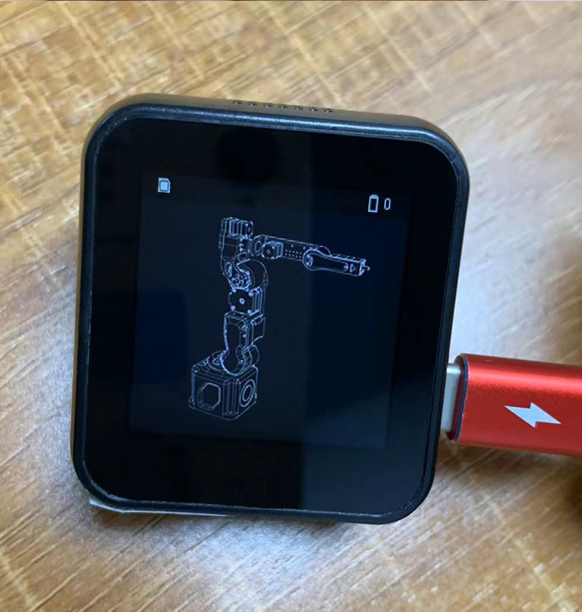
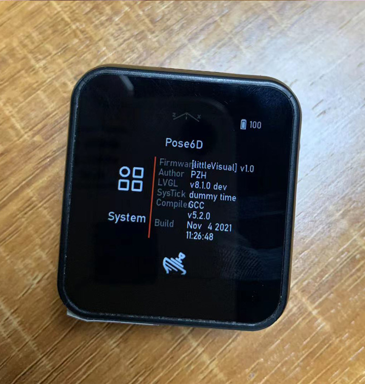

<h1 align = "center">🌟T-Watch-2019-reissue-peak🌟</h1>

### This example is based on the firmware ported by [`Peak`](https://github.com/peng-zhihui/Dummy-Robot), which supports simple touch screen operation.

#### Already adapted:
- Bluetooth
- wifi
- touch
- imu
- power
- display

